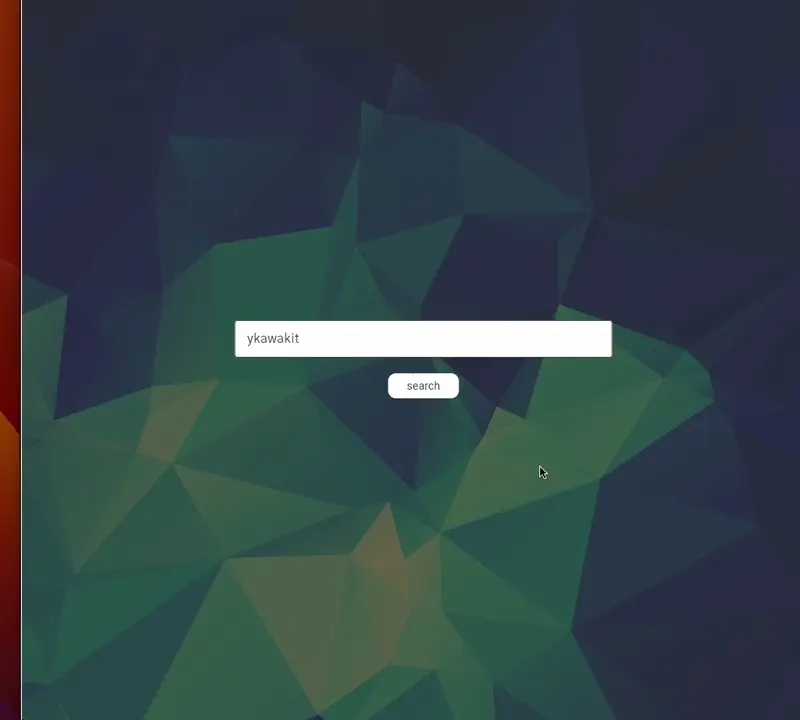
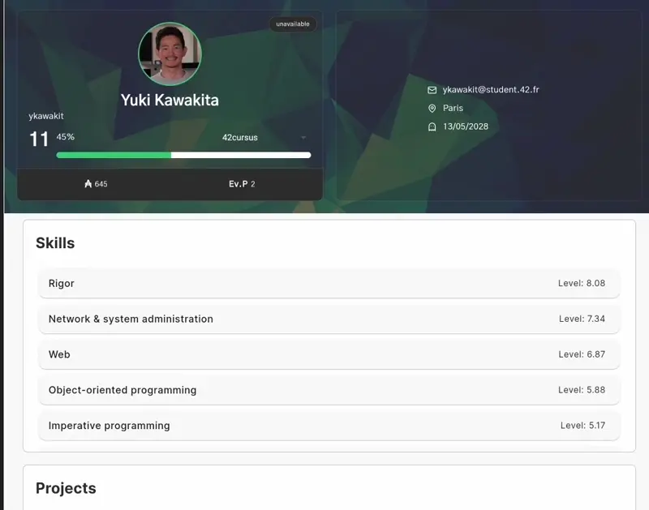

<h2>Welcome!👋 My name is Yuki, I'm a student at 42 Paris.</h2>

<!--  -->

## Projects

<!-- Project cards -->
| [swifty-companion](https://github.com/yuuuuki15/swifty_companion) |
|---|
||
| A mobile application to search student info for 42 students |

## Language/Framework/Tools

